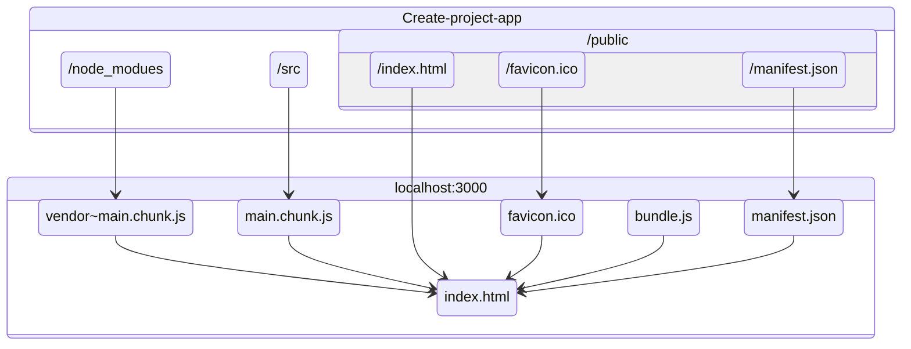

# Приложение React

Приложение собрано с использованием [Create React App](https://github.com/facebook/create-react-app).

## Доступные скрипты

Вы можете запустить в директории проекта:

### ***`npm start`***

Запускает приложение в режиме разработки.
Откройте [http://localhost:3000](http://localhost:3000) для запуска приложения в браузере.

При внесении изменений приложение обновится.\

### Также доступны скрипты

#### ***`npm test`***
#### ***`npm run build`***
#### ***`npm run eject`***

Подробнее [NPM - scripts](https://docs.npmjs.com/cli/v7/using-npm/scripts)

### UML-схема сборки приложения на React



```
@startuml packaging
component "Create-project-app" as project  {

    folder "/node_modues" {
        artifact "/..." as node_modules
    }
    folder "/src" {
        artifact "/..." as src
    }
    folder "/public/..." as public {
        file "/index.html" as public_index
        file "/favicon.ico" as public_favicon
        file "/manifest.json" as public_manifest
    }
}

cloud {
    card "localhost:3000" {
        file "manifest.json" as manifest
        file "main.chunk.js" as main
        file "favicon.ico" as favicon
        file "vendor~main.chunk.js" as vendor
        file "bundle.js" as bundle

        node_modules --> vendor
        src --> main
        public_favicon --> favicon
        public_manifest --> manifest

        artifact "index.html" as index {
            public_index --> index
            manifest --> index
            main --> index
            favicon --> index
            vendor --> index
            bundle -r-> index
        }
    }
}
@enduml
```


|    Задание    | Обязательность  |     Наличие   |
|:------------- |:---------------:| -------------:|
| UML-схема     |        да       |      *mermaid*|
| Картинка      |        да       |           есть|
| Таблица       |        да       |           есть|
| Форматирование|        да       |           есть|